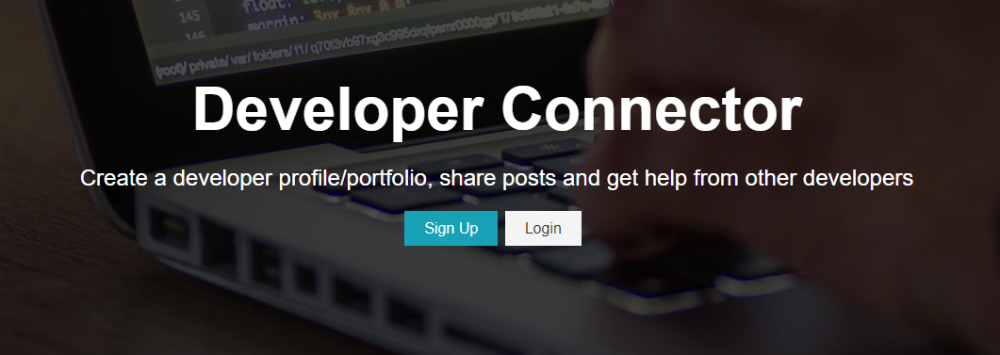
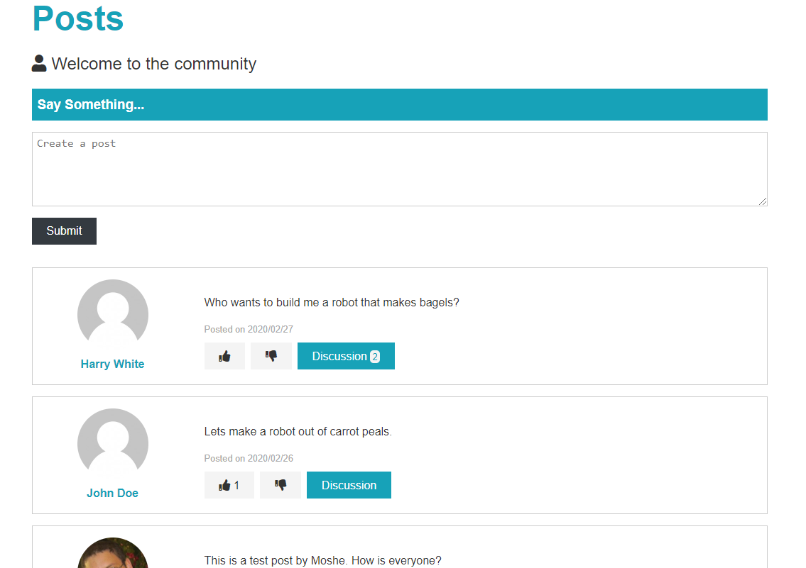

# DevNetwork

DevNetwork is a social networking website for programmers to stay connected with friends and coworkers.\
Tech stack: **React, Redux, Node, Express, MondoDB**

## User experience

Users start by creating a profile of their job experiences and skills. Afterwards, they can create posts or comment on their friends' postings.

### Login page

### Posts and comments

